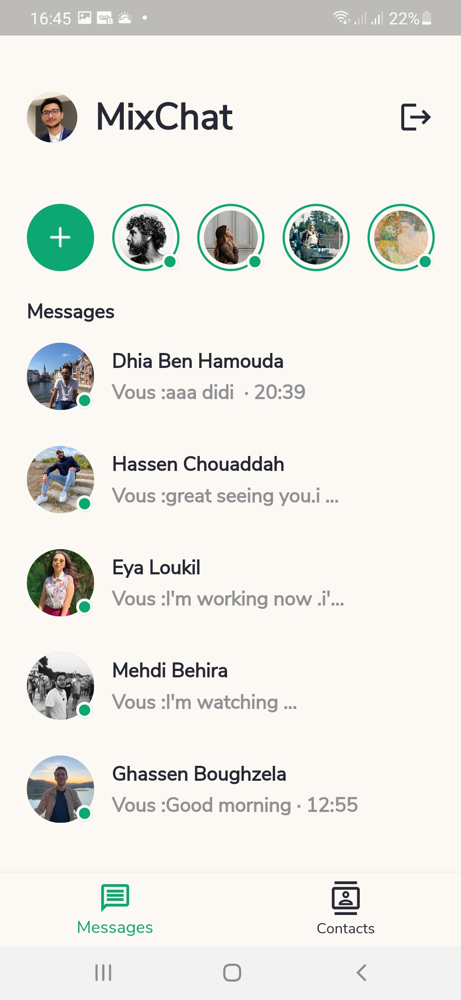
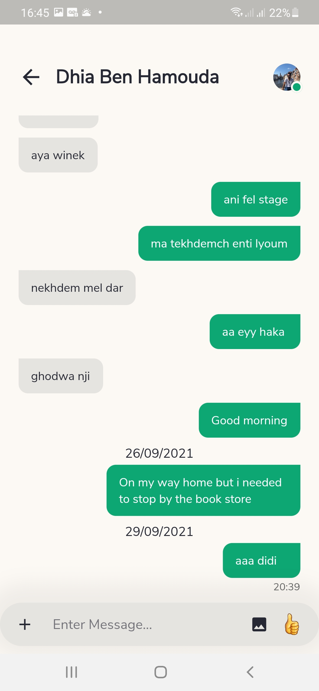
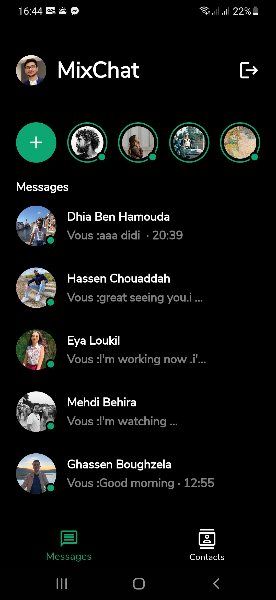
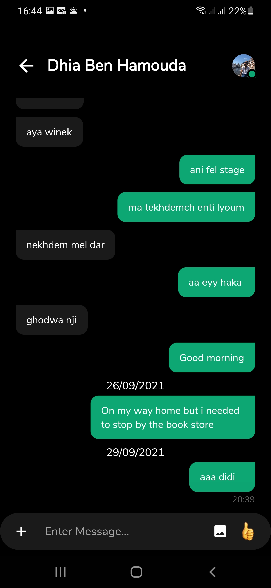

# MixChat

real-time chat application

## Captures d'Écran

    

## Construire depuis la Source

1. Si vous n'avez pas le SDK Flutter installé, merci de visiter le site officiel de [Flutter](https://flutter.dev/).
2. Récupérez le code source de la branche master.

```
git clone https://github.com/youssefmarzouk621/MixChat.git
```

3. Lancez l'application avec Android Studio ou VS Code. Ou dans la ligne de commandes:

```
flutter pub get
flutter run
```
